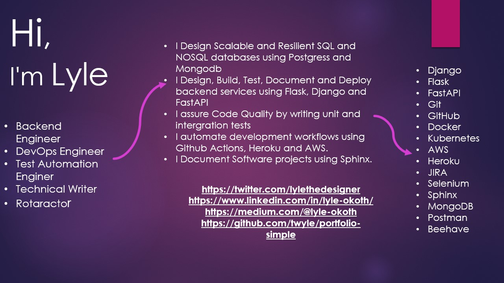

# A Template For Deploying a flask app to EBS.

> This flask application enables enables an admin to register then authorizes them to create new users.

<p align="center">
  
  
  
  
  
  
  
  
  
  
  
  
  
  
  
</p>



## Project Overview

This is a User managementsystem that enables an admin user to register and then authorizes them to create other non-admin users. The admin registers using a unique email address and user then has to confirm their account via a link sent to their email. Once their account is confirmed,they can then log into the application, upon which they receive an authorization token. Using this token, the admin can then create other non-admin users.

## Working

It's pretty easy to use the application. On the home page (http://localhost:5000/apidocs):

 1. Register as an admin, using a unique email address, unique name and a password.
 2. Head over to the email address that you provided and click on the confirmation link.
 3. At the application home page, log in with the email address and password, to get back a token.
 4. Use the token, to authorize the user.
 5. Make requests to the user routes to create, update, view or delete a user.

Here's a video showing how to use the application:

<p align=center>
  
  
</p>

<p align=center>
  
  
</p>

## Features

This application has several features including:
 1. Deployed to an AWS EBS using a custom domain name.
 2. Versioned using Git and Hosted on GitHub.
 3. Auto-deployed to AWS EBS using AWS CodePipeline.
 4. Uses USWGI as the application server and nginx as the proxy.
 5. Uses AWS SES to send emails.
 6. Uses AWS Opensearch and Firehose for logging as filebeats.
 7. Uses AWS Secrets manager to manage the application secrets and AWS KMS for key management.
 8. Uses AWS RDS PostgreSQL for data storage.
 9. Uses JSON Web Tokens to authorize users.
 10. Uses AWS Route53 to route traffic to the application.
 11. Built using flask, flask-mail, flask-jwt
 12. Documented using swagger

## Application Structure

```sh
repo-template/
│
└───.github/
│     │
│     └───workflows/
|             |
|             └───feature-development-workflow.yml
|             |
|             └───development-workflow.yml
|             |
|             └───staging-workflow.yml
|             |
|             └───release-workflow.yml
|             |
|             └───production-workflow.yml
│
└───resources/
│     |
│     └───images/
│     |     |
|     |     └───header.jpg
|     └───videos/
|           |
|           └───header.gif
|
└───services/
│     |
│     └───database/
│           |
|           └───.env
|           |
|           └───database-compose.yml
└───api/
│     |
|     └───blueprints/
|     |
|     └───config/
└───tests/
|
└───.env
|
└───Dockerfile.dev
|
└───manage.py
|
└───requirements.txt
|
└───.gitignore
|
└───.pre-commit-config.yaml
|
└───.pylintrc
|
└───LICENSE
|
└───Makefile
|
└───pytest.ini
|
└───README.md
|
└───requirements-dev.txt
|
└───setup.cfg
```

* **repo-template/.github/workflows** </br>
  *Holds the GitHub Action workflow files.*

* **repo-template/resources** </br>
  *Holds the resources used to describe this project.*

* **repo-template/services/database** </br>
  *Holds the database compose file and the database environment variables.*

* **repo-template/api** </br>
  *Holds the api code*

* **repo-template/api/config** </br>
  *Holds the application configuration.*

* **repo-template/services/web/api/blueprints** </br>
  *Holds the flask blueprints.*

* **repo-template/api/blueprints/default** </br>
  *Holds the default blueprint.*

* **repo-template/tests** </br>
  *Holds the api tests.*

## Local Setup

Here is how to set up the application locally:

  1. Clone the application repo:</br>

      ```sh
      git clone https://github.com/twyle/repo-template-ebs.git
      ```

  2. Navigate into the cloned repo:

      ```sh
      cd repo-template-ebs
      ```

  3. Create a Virtual environment:

      ```sh
      python3 -m venv venv
      ```

  4. Activate the virtual environmnet:

      ```sh
      source venv/bin/activate
      ```

  5. Install the project dependancies:

      ```sh
      make update # update the package manager
      make install-dev  # install the development requirements
      make install  # install the runtime requirements
      make pre-commit # initialize pre-commit
      ```

  6. Create the environment variables:

      ```sh
      touch .env
      ```

      Then paste the following into the file:

      ```sh
        SECRET_KEY=supersecretkey

        POSTGRES_HOST=<YOUR-IP-ADDRESS>
        POSTGRES_DB=lyle
        POSTGRES_PORT=5432
        POSTGRES_USER=postgres
        POSTGRES_PASSWORD=lyle

        MAIL_HOST=<YOUR-MAIL-HOST>
        MAIL_PORT=<YOUR-MAIL-PORT>
        MAIL_USERNAME=<YOUR-USER-NAME>
        MAIL_PASSWORD=<YOUR-PASSWORD>

        FIREHOSE_DELIVERY_STREAM=flask-logging-firehose-stream

        AWS_KEY=<YOUR-AWS-KEY>
        AWS_SECRET=<YOUR-AWS-SECRET>
        AWS_REGION=<YOUR-AWS-REGION>
      ```

      Then create the database secrets:

      ```sh
      cd services/database
      touch .env
      ```

      Then paste the following into the file:

      ```sh
        POSTGRES_DB=lyle
        POSTGRES_PORT=5432
        POSTGRES_USER=postgres
        POSTGRES_PASSWORD=lyle
      ```

  7. Start the database containers:

      ```sh
      make start-db-containers
      make create-db
      make seed-db
      ```

  8. Start the application:

      ```sh
      make run
      ```


## Development

 #### 1. Application Design

  1. **Database**

      The database was designed to store the Admin details as well as the users details. These are stored in the tables admin and users.

  2. **Routes**

      Here are the application routes:

      | Route       | Method      | Description      |
      | ----------- | ----------- |----------------- |
      | '/'         | GET         | Get the home page |
      | '/user'     | GET         | Get a single user by supplying an ID |
      | '/user'     | POST        | Create a new user by supplying the email address |
      | '/user'     | PUT         | Update a single user's data by supplying the user ID and email address |
      | '/user'     | DELETE      | Delete a single user by supplying the users ID |
      | '/users'    | GET         | Get the list of all created users |
      | '/auth/register'     | POST         | Register a new admin. |
      | '/auth/login'     | POST         | Login a registered admin to get an access token. |
      | '/auth/me'     | GET         | Get a logged in admins data. |
      | '/auth/me'     | PUT         | Update a logged in admins data. |
      | '/auth/me'     | DELETE      | Delete a logged in admins data. |
      | '/auth/admins'     | GET         | Get all logged in admins data. |

  3. **Logging**

      The application logs to the standard output as well as to AWS OpnSearch using AWS Firehose. Both logging options use custom loggers.

  4. **Security**

      The application uses JSON Web Tokens to authorize access to protected routes. The passwords are also encrypted.

 #### 2. Project Management

   1. **Coding standards** </br>

      The application had to adhere to the following coding standards:
      1. Variable names
      2. Function names
      3. Test driven development
      4. Individual modules need 60% coverage and an overall coverage of 60%.
      5. CI/CD pipeline has to pass before deployments.
      6. Commit messages format has to be adhered to.
      7. Only push code to github using development branches.
      8. Releases have to be tagged.
      9. Use pre-commit to run code quality checks
      10. Use comitizen to format commit messages

   2. **Application development process management** </br>

      The project uses JIRA for management.

 #### 3. Development Workflow

 The application uses atleast 5 branches:

  1. Features branch used to develop new features.
  2. Development branch used to hold the most upto date features that are yet to be deployed.
  3. Staging branch holds the code that is currently being tested for production.
  4. The release branch holds all the assets used when creating a release.
  5. The production branch holds the code for the currently deployed application.

The development workflow follows the following steps:

  1. A feature branch is created for the development of a new feature.
  2. The code is then pushed to GitHub, triggering the feature-development-workflow.yml workflow. If all the tests pass, the feature is reviewde and merged into the development branch.
  3. The code in the development branch is then deployed to the development environment. If the deployment is succesful, the development branch is merged into the staging branch.
  4. This triggers the staging workflow. If all the tests are succesful, this branch is reviewed and deployed to a staging environment.
  5. For creatinga release, the staging branch is merged into the release branch. This happens when a tag is pushed to GitHub.
  6. Once a release is created, the release branch is merged into the production branch, which is deployed into production.

The workflows require a couple of secrets to work:

      ```sh
        FLASK_ENV=development

        SECRET_KEY=supersecretkey

        POSTGRES_HOST=localhost
        POSTGRES_DB=lyle
        POSTGRES_PORT=5432
        POSTGRES_USER=postgres
        POSTGRES_PASSWORD=lyle

        MAIL_HOST=<YOUR-MAIL-HOST>
        MAIL_PORT=<YOUR-MAIL-PORT>
        MAIL_USERNAME=<YOUR-USER-NAME>
        MAIL_PASSWORD=<YOUR-PASSWORD>

        FIREHOSE_DELIVERY_STREAM=flask-logging-firehose-stream

        AWS_KEY=<YOUR-AWS-KEY>
        AWS_SECRET=<YOUR-AWS-SECRET>
        AWS_REGION=<YOUR-AWS-REGION>

      ```

The workflows also require the followingenvironments to work:

  1. Test
  2. Staging
  3. Development
  4. Production

And within each environment, create a secret that indicates the environment type i.e

  1. Test -> ```FLASK_ENV=test```
  2. Staging -> ```FLASK_ENV=stage```
  3. Development -> ```FLASK_ENV=development```
  4. Production -> ```FLASK_ENV=production```

## Deployment

The deployemt process for this application can be divided into two groups:

 * Initial Deployment
 * Incremental deployment

The initial deployment describes the first dployment to the AWS EC2 instance. The process involves the following steps:

 1. **Setting up an EBS python environment**

    Create a python environment on AWS Elastic Beanstalk with the default application code.

 2. **Setting up the PostgreSQL Database**

      In the configuration section of your created python environmnet, create a PostgresQL database. Make sure to note the database details including the endpoint (hostname), the db name, the port, the username and password.

 3. **Update the environmen variables**

      In the config section, update the environmnet variablse that the application uses. These include:

      ```sh
      FLASK_ENV=development

      SECRET_KEY=supersecretkey

      JWT_ACCESS_TOKEN_EXPIRES=3
      JWT_REFRESH_TOKEN_EXPIRES=30

      POSTGRES_HOST=aaq9zqczcrejfq.xxxxxxxx.us-east-1.rds.amazonaws.com
      POSTGRES_DB=<db-name>
      POSTGRES_PORT=5432
      POSTGRES_USER=<user-you-created>
      POSTGRES_PASSWORD=<pasword-you-provided>

      MAIL_HOST=email-smtp.us-east-1.amazonaws.com
      MAIL_PORT=465
      MAIL_USERNAME=<YOUR-USER_NAME>
      MAIL_PASSWORD=<YOUR-PASSWORD>
      ```

 4. **Creating a CodeDeploy Pipeline**

      Create a CodeDeploy Pipeline, with only a source and deploy stages. Use GitHub repo as your source and your created app as your deployent target. Once the pipeline is done running, you should be able to access your application.

 5. **Setting up the application domain**

      Purchase a domain name then use Route53 to create a hosted zone.

 6. **Set up a Load balancer for your application**

      In your application configurations, set up a load balancer. Change the capicty to load balanced, this will lead to the creation of a load balancer for your application.

 7. **Creating an SSL certificate for your domain**

      Use AWS ACM to request a new SSL certificate.

  8. **Creating an CNAME Record in Route53**

      Create a CNAME record in Route53 to work with the SSL certificate.

  9. **Creating an A record that points to your EBS app.**

      Create an A record that points to your EBS application.

  10. **Configure HTTP to HTTPS redirection for your application.**

      Modify the load balancer configuration and add a listener for HTTPS traffic on port 443..

  11. **Setting up Logging**

      This involves creating a FirehoseDeliveryStream as well as AWS OpenSearch.

      Once the application is up and running, you can view the logs by heading over to the OpenSearch dashboard. Here is a video showing some logs:

      

The incremental deployment describes the process of deploying new changes to the already deployed application. This is handled with the CodeDeploy Pipeline ad happens automatically evry time code is pushed into the development branch.

## Releases

## v0.1.0 (2022-07-19)

### Feat

- autodeploying to AWS beanstalk.
- initial layout.

## v0.0.1 (2022-07-19)

## Contribution

1. Fork it https://github.com/twyle/repo-template-ebs/fork
2. Create your feature branch (`git checkout -b feature/fooBar`)
3. Commit your changes (`git commit -am 'Add some fooBar'`)
4. Push to the branch (`git push origin feature/fooBar`)
5. Create a new Pull Request

## Developer

Lyle Okoth – [@lylethedesigner](https://twitter.com/lylethedesigner) on twitter </br>

[lyle okoth](https://medium.com/@lyle-okoth) on medium </br>

My email is lyceokoth@gmail.com </br>

Here is my [GitHub Profile](https://github.com/twyle/)

You can also find me on [LinkedIN](https://www.linkedin.com/feed/)

## License

Distributed under the MIT license. See ``LICENSE`` for more information.
